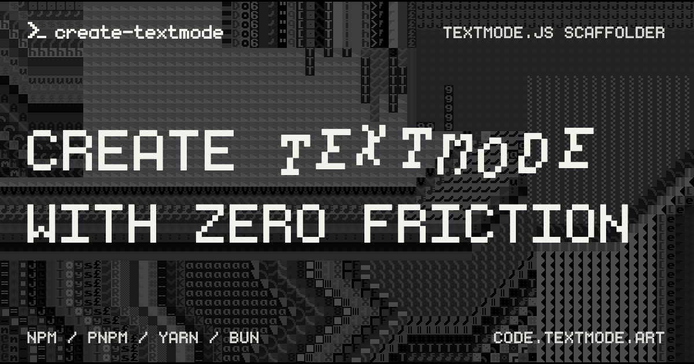

# create-textmode (✿◠‿◠)

<div align="center">



| [](https://developer.mozilla.org/docs/Web/JavaScript) [](https://vitejs.dev/) | [](https://github.com/humanbydefinition/textmode.js) [](https://code.textmode.art/) [](https://discord.gg/sjrw8QXNks) | [](https://ko-fi.com/V7V8JG2FY) [](https://github.com/sponsors/humanbydefinition) |
|:---|:---|:---|

</div>

`create-textmode` is a command-line tool to quickly scaffold new projects using `textmode.js` with sensible defaults and minimal friction.

Just run the CLI via `npm create textmode@latest` or your package manager's equivalent command, answer a few prompts, and you're ready to start building!

## Features

- **One-command scaffolding** - Start a new project with `npm create textmode@latest` or your package manager's equivalent
- **Interactive prompts** - Choose project name, template, textmode.js version, official add-ons, dependency installation, and dev server startup
- **JavaScript and TypeScript templates** - Vanilla starters plus Tweakpane-controlled UI variants
- **Package-manager aware** - Auto-detect npm, pnpm, yarn, or bun
- **Non-interactive flags** - Full CLI options for scripts and CI
- **Sensible defaults** - Vite, `textmode.js`, Prettier, ESLint, and a `.gitignore`; TypeScript variants add `tsconfig` and a `typecheck` script

## Try it online first

Open [editor.textmode.art](https://editor.textmode.art/), a browser-based live-coding environment for the complete official `textmode.js` ecosystem, to try textmode.js before or alongside scaffolding; sketches run as you edit, with no local toolchain required.

## Requirements

- Node.js 18+ *(per `engines`)*
- One of: npm, pnpm, yarn, or bun on your PATH

## Quick start

```bash
npm create textmode@latest
# or
pnpm create textmode@latest
# or
yarn create textmode
# ...
```

The CLI will prompt for project name, template, textmode.js version, official add-ons, installing dependencies, and starting the dev server.

## Non-interactive examples

```bash
# TypeScript template, pin textmode.js, auto-install, do not run dev server
npm create textmode@latest my-textmode-app -- --template vanilla-ts --textmode-version 0.7.1 --install --no-run

# JavaScript template with pnpm, skip install and run
pnpm create textmode@latest demo -- --template vanilla-js --pm pnpm --no-install --no-run

# Pre-install the synth and export add-ons and wire their plugins into the starter sketch
npm create textmode@latest audio-art -- --template vanilla-js --addons synth,export --install --no-run
```

## Options

- `--template <name>`: choose a template *(prompts if omitted)*
- `--addons <name1,name2,...>`: pre-install official textmode.js add-ons and wire their plugins into the starter sketch *(prompts via multi-select if omitted)*
- `--name <projectName>` or first positional arg: directory/package name *(default suggestion if omitted)*
- `--textmode-version <ver>`: pin textmode.js *(prompts from fetched stable versions; defaults to `latest`)*
- `--pm <npm|pnpm|yarn|bun>`: force a package manager *(auto-detected otherwise)*
- `--install` / `--no-install`: install dependencies after scaffold *(prompts if neither is provided)*
- `--run` / `--no-run`: start the dev server after install *(prompts if neither is provided)*
- `--force`: allow using a non-empty directory without prompting
- `--help`: show usage
- `--version`: show the CLI version

## Templates

All templates ship with Vite, `textmode.js`, Prettier, ESLint, and a `.gitignore`. TypeScript variants add `tsconfig` and a `typecheck` script. Below are the extras that differ by template:

| Template | Flavor | Extras |
|:---------|:-------|:-------|
| `vanilla-js` | JavaScript | Base starter sketch |
| `vanilla-ts` | TypeScript | Base starter sketch + TS config |
| `vanilla-js-tweakpane` | JavaScript + Tweakpane | UI controls wired with Tweakpane |
| `vanilla-ts-tweakpane` | TypeScript + Tweakpane | UI controls wired with Tweakpane + TS config |

Adding new templates? Keep the shared tooling note above and only list what’s unique in the table.

## Add-ons

All official textmode.js add-on libraries are supported. When selected, the CLI adds the package to your `dependencies` and registers its plugin on the `textmode.create({ ... })` call in the starter sketch.

| Id | Package | Latest plugin export | Requires |
|:---|:--------|:---------------------|:---------|
| `export` | `textmode.export.js` | `ExportPlugin` | textmode.js ≥ 0.16.0 |
| `synth` | `textmode.synth.js` | `SynthPlugin` | textmode.js ≥ 0.16.0 |
| `figlet` | `textmode.figlet.js` | `FigletPlugin` | textmode.js ≥ 0.16.0 |
| `filters` | `textmode.filters.js` | `FiltersPlugin` | textmode.js ≥ 0.16.0 |

> [!NOTE]
> Add-ons require `textmode.js >= 0.16.0`. If you pin an older textmode.js version while
> selecting add-ons, the CLI will auto-upgrade to `latest` with a warning.

## Next steps

- **[Read the documentation](https://code.textmode.art/)** for core concepts, guides, and installation details.
- **[Follow the installation guide](https://code.textmode.art/docs/installation)** to install `textmode.js` and official add-ons in a scaffolded project.
- **[Explore the examples gallery](https://examples.textmode.art/textmode.js/)** for runnable sketches and patterns.
- **[Try the live editor](https://editor.textmode.art/)** to sketch interactively in the browser.

## Local development

```bash
npm install
npm test          # vitest
npm run test:verbose

# Run CLI directly (no npm-create shim); no "--" needed
node bin/index.js demo --template vanilla-js --pm pnpm --no-install --no-run
# or
node bin/index.js
# ...
```

## Contributing

Thank you for considering contributing to this project! (✿◠‿◠)

Please read the [Contributing Guide](https://code.textmode.art/docs/contributing/code) to get started, and follow the [Code of Conduct](./CODE_OF_CONDUCT.md) in all community spaces.

## License

`create-textmode` is licensed under the [MIT License](./LICENSE).
